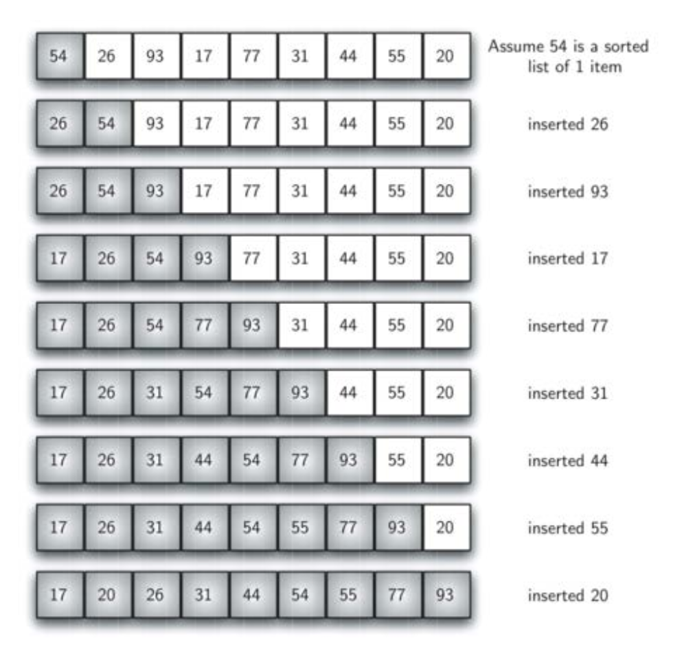
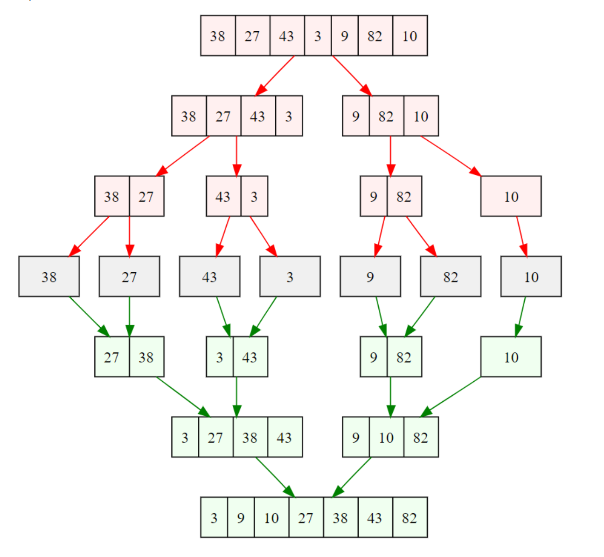

# Sorting and Searching Algorithms (and Best/Avg/Worst Case Runtimes)

## Best/Average/Worst Case

Algorithms that take input can vary in runtime depending on the input values.

We still consider n to be some large number.
- Best Case: Best possible input arrangement.
- Worst Case: Worst possible input arrangement.
- Average Case: Harder to find; Take the mean of the runtimes of each possible input. Inputs could appear in different positions with different probabilities.

Linear Search Example:
- Best Case: Element we seek is the first element.
- Worst Case: Element we seek is the last element.
- Average Case: 


## Searching

### Linear Search

Scan through each element of the array.
- O(1) best case
- O(n) avg case
- O(n) worst case

### Binary Search

Works for sorted arrays only. Check middle element. If lower than desired value, adjust range to 1 + middle and end. Else, if higher than desired value, adjust range to start and middle - 1. If equal, stop.

- O(1) best case
- O(logn) avg case
- O(logn) worst case

## Sorting

### Selection Sort

1. Find smallest element
2. Swap with first element.
3. Repeat with rest of the array.

    ```
    void selection_sort(int a[], int n) {
        for (int i = 0; i < n - 1; ++i) {
            int min = i;
            for (int j = i + 1; j < n; ++j) {
                if (a[j] < a[min]) min = j;
            }

            int temp = a[min];
            a[min] = a[i];
            a[i] = temp;
        }
    }
    ```

- O(n^2) best case
- O(n^2) avg case
- O(n^2) worst case

### Insertion Sort

For each element x:
1. Find where x should go
2. shift elements > x
3. Insert x
4. Repeat



- O(n) best case
- O(n^2) avg case
- O(n^2) worst case

### Merge Sort

1. Divide array in half until we end up with several subarrays of length 1.
2. Notice that arrays of length 1 are sorted.
2. Perform a merge operation on the subarrays.



O(n log n) runtime
O(n) space

### Quick Sort

1. Pick a pivot element in the array.
2. Put all smaller elements before pivot. Push all larger elements after pivot.
    - Good pivots split the array in half.
3. Recursively sort the two partitions.

Methods for choosing pivots:
- Lomuto Partition
- Median of Medians

```
void quick_sort(int a[], int n) {
    if (n <= 1) return;

    int m = 0; // 0th element is the pivot
    for (int i = 1; i < n; ++i) {
        if (a[i] < a[0]) {
            ++m;
            swap(&a[m], &a[i]);
        }
    }

    // Put pivot between partitions
    swap(&a[0], &a[m]);
    quick_sort(a, m);
    quick_sort(a + m + 1, n - m - 1);
}
```

O(n log n) runtime
**Key Benefit**: No temporary arrays!


### C built-in sort

in `<stdlib.h>`

```
qsort(void* base, size_t n, size_t size,
      int (*compare)(const void* a, const void* b));

/*
base: beginning of array
n: array length
size: size of array element
compare: comparison function between elements
*/
```