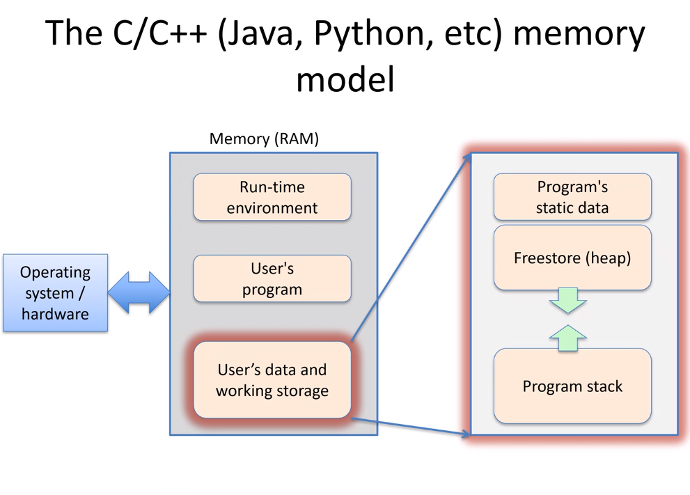
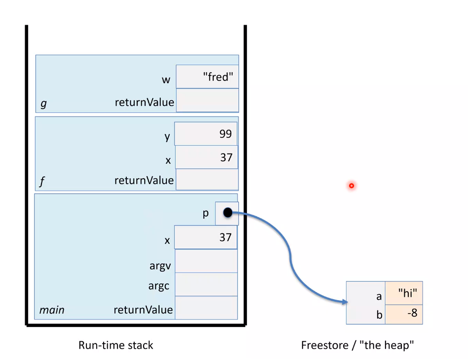

# C++ Memory Model

**The Stack**: The stack of tasks that are created when the computer is performing an operation.

* As we start a new task, we need to pause and perform a sub-task first.

### The Memory Model

Suppose we pause execution in the middle of a function call: `main -> f -> g`

* **Static data**: Keeps consts, etc.
* **Runtime stack**: Manages the storage needs (local vars + params) for each pending function call.
    * **Stack frame**: Section of the stack dedicated to a block of code.
* **The heap (aka freestore)** has the actual storage for all dynamically-allocated "objects".
* Total storage is finite.
    * Can ask OS for more but not guaranteed.

