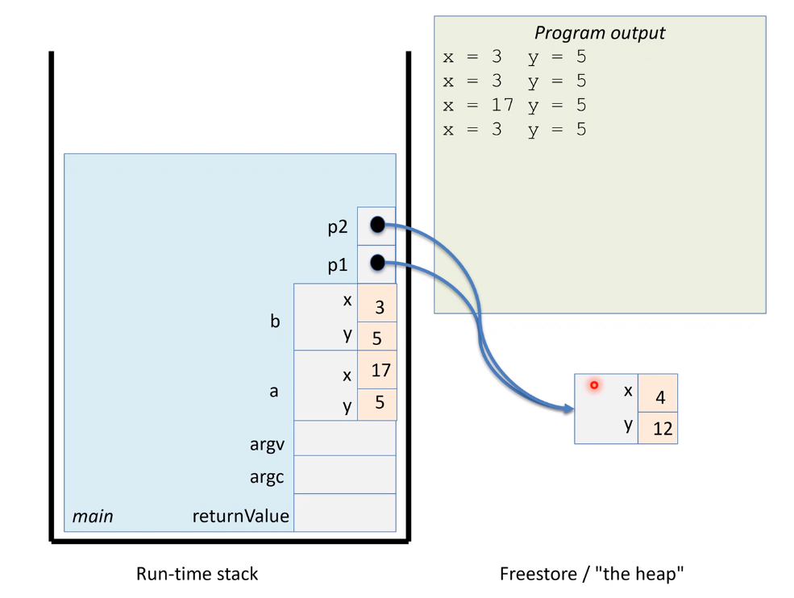

# Structs and Classes

Instances of classes/structs are called *objects*. Two ways to instantiate in C++:

1. Direct (automatic) instantiation

    ```
    className obj;
    obj.field = 10;
    ```

    * Space allocated on runtime stack
        * Instances are popped at the end of their defining scope.
        * Issue if we want to pass around linked structures.

2. Dynamic instantiation

    ```
    className ptr = new className;
    ptr->field = 10;
    ```

    * Space allocated on the heap.
        * Instances exist until `delete`d by programmer.

Outline of behaviours

```
void print(Coord c);

int main() {
    // stack obj
    Coord a{};
    a.x = 3;
    a.y = 5;

    Coord b = a; // obj copy
                 // fields are also copied

    // a and b copied into a new var c in print
    print(a);
    print(b);

    // heap obj
    Coord* p1 = new Coord{}; // Pointer allocated on stack
                           // Coord allocated on heap
    
    p1->x = 4;
    p2->y = 12;

    // Pointer copy
    Coord* p2 = p1; // Pointer copied BUT NOT COORD ON HEAP
                    // p1 and p2 point to the same thing
    
    // At this point: fig 1
    // p2 is an alias for object pointed to by p1.

    p1->x = 73;
    // p2->x is now 73

    // Could be dangerous! p3 is a ptr to a stack object
    Coord* p3 = &a;
    p3->y = 86; // a.y is now 86

    delete p1; // ok!
    delete p2; // error! undefined behaviour.
    delete p3; // error! segfault: deleting stack object.
}
```

