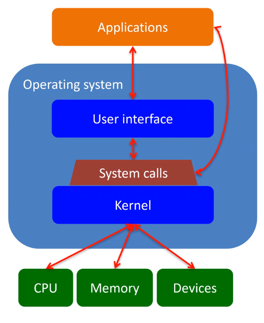

# Unix

### Operating Systems

* Abstraction layer that allows software to operate on multiple different machines.
* Kernel: "Core"; where the OS actually interacts with the hardware.
* Manages execution of apps, time sharing, communication, sharing of resources.

### Unix History

* Operating systems used to be written in Assembly.
    * i.e. Each OS only worked for one computer

* Unix is a family of operating systems that follow the "Unix Philosophy"
    * OS should be a collection of simple tools that form a pipeline.

* Richard Stallman founds GNU project and the FSF (Free Software Foundation)
    * Wanted to create a "truly free" UNIX-like operating systems.
    * Original main components:
        * GCC (GNU Compiler Collection)
        * glibc
        * GNU coreutilities
    * Linus Torvalds wrote the kernel (Linux) later on

* Four Software Freedoms
    * Freedom to **run** the program.
    * Freedom to **change** the program.
    * Freedom to **distribute** the program.
    * Freedom to **distribute** your changes.